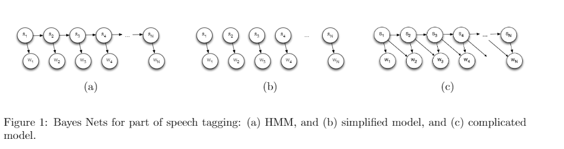

# ASSIGNMENT 3
Team:
Ruchik Dama (IU username : rdama)

Shashank Kumar (IU username : sk128)

Sumanth GopalKrishna (IU username : sgopalk)

# PART 1 POS TAGGING
The goal for this part of the assignment was to implement Part of Speech Tagging using 3 bayes networks shown below.

We have to implement 3 different networks which are,

1. Simplified Model
2. HMM (Viterbi)
3. MCMC (Gibbs Sampling)

## IMPLEMENTATION

#### We are taking the negative log of the probabilities and minimizing it.

We have to first train the data,

### TRAINING

We have a function called train that trains using the dataset.
In the training part of our problem, we calculate all the probabilities that are needed for all 3 bayes network.

#### For Initial Probability, 
p(s) = occurrce of s in first word of the sentence of data.
Here s is a POS tag and w is word.
We are using a dictionary named start_dict. The dictionary stores the total instances of all parts of speech which occur in the beggining. example: ({noun:5,verb:6})

#### For Emission Probability,
p(W/S) = c(S,W)/c(S)
We are using a dictionary named word_dict. The dictionary stores the total instances of word being a part of speech. 
example: ({{sumanth:{noun:1,verb:3}},{is:{adp:2}}})

#### For Transitional Probability,
p(s_i+1,s_i) = c(s_i+1,s_i)/c(s_i)
We are using a dictionary named transition_dict. In this dictionary we calculate, P(POS1|POS2). This dictionary stores total instances  
POS1|POS2. The format of this dictionary is :
{"POS1PO2":3,"POS2POS3":4}

We also have a dictionary named pos_word_dict that calculates the probabilty P(word|POS1,POS2). This dictionary stores the total instances of word|POS1,POS2 in the format : 
{{word1:{"POS1PO2":3,"POS2POS3":4}}}

### SIMPLIFIED MODEL
In simplified Model, we only have the emission probability.
To get the most probable POS for the words of sentence we find the tag which is has maximum probability among all the other POS associated with this word.

The steps that we followed for simplified model, is:-
1. We calculate the probabilities of all the word->every pos tag.
2. We then store the pos tag with the maximum probability.

If a word or POS is present in test set but not in train set, then that word is assigned the most occuring POS in the train corpus.

### HMM(VITERBI)
In HMM model we have both emission as well as transition probability.
In this case the observed variable is dependent on it's hidden variable and also on the hidden variable of the previous observed variable.

Steps followed in the HMM model:
We maintained a dictionary which holds all the probabilities for all the POS for a word. We calculate the highest probability POS for the sentence by backtracking in the list.
-At first we calculate the probability for the first column of POS using the emission and the initial probabilities.
-Then we calculate the probabilites of the rest of the columns using the transition probabilities and the emission probabilities.
-We take the combine the probabilites using the ###negative log and hence we minimize this probability and take the best combinaiton of POS.
-we return this list which is the minimum by backtracking.

### MCMC(GIBBS SAMPLING) (Monte carlo markov chains)

For every word we have to calculate probability for every part of speech.
We calculated the probabilities for gibbs sampling as :-

1. For First Word of the sentence, initial*emision
2. For last Word of the sentence, transition*P(word|POS1,POS2)
3. For the other words, transition(POS1POS2)*P(word|POS1,POS2)*P(next_word|POS2,POS3)*transition(POS2POS3)

For every sample, each word's probability is calculated for all 12 parts of speeches and the tag that gives highest probability is considered for that word. The POS of this word is then updated in the current sample which is used in next iteration of samples. This is done for many samples and then tag count is stored for every word from the samples. The starting few samples are ignored as it would be random in the first few cases. The POS having maximum count for a word will be the final POS for that word, and thus final pos list will have tags with maximum probability tag value for all the words.

We then store the pos with the maximum probability.
Many samples are processed where the values of initial sample is consists noun for every word in a sentence.

Once the dataset is created we then select last few rows and calculate the probabilities for each word as each POS.
We then select the POS with maximum probability.

### POSTERIOR PROBABILITY
for Posterior probability P(POS|word)=P(POS)*P(word|POS) 

P(word|POS) is stored in our word_dict dictionary which is the emission probability.  
P(POS) is stored in pos_all dictionary which stores the total instances of every POS.  
We are using negative log with base 10 for our calculations.  

### Problem Faced and Assumptions made
The program is running slow because we are calculating the probabilities on the go using the dictionary. We did this assuming the test data would not be too big to compute the probability each time.
### Problem: 
We were using dictionary of dictionary and to get the values I was doing it on the go, hence it was taking time. I computed dictionary values for the probability as well and now it runs much faster.

# Part 2 : Mountain finding

The problem statement is to identify the ridgeline, i.e. the boundary between the sky and the mountain from the images. The initial code loads the images and outputs an edge strength map. We had to find the ridge using three methods.

## Simple Bayes net:
For the simple bayes net, we selected the index which has the highest pixel value. For few images, we were able to see the ridge line but for many it was a naïve approach.

## Viterbi Encoding:
To do Viterbi encoding we have to calculate initial probability, transition probability and emission probability.

### Emission probability: 
We used min-max normalization for each column of images. Converted the value between 0 to 1.

### Initial probability:
We consider the first column of emission probability as the initial probability

### Transition probability: 
For transition probability we used multiple approaches. But in our final code, we considered for each node we take 5 pixels from the previous columns (one in the same row, and 2 above and below this pixel). We give higher weightage to the pixel on the same row, compared to other two rows. For the difference of one row, we give half the probability which we gave in the same row. And small probability to row+-2 pixel. We give zero probability to other cells. As in our test image there is no sudden drop of ridgeline, due to which our approach works fine

Once we have all the probability values we traverse through column, we start with second column (first column initial probability), and we maximize initial probability * transition probability and assign it to that node which becomes the state probability. And for the subsequent columns we keep on maximizing the state probability * transition probability. We save the index value for the maximized (state probability * transition probability) of the previous columns in a matrix so that we can back track the index values from where the maximization happened.

Viterbi is giving way better results than bayes net but in few images, it capture the ground level than mountain ridge line. To solve this issue human feedback is need 

## Viterbi Encoding with human feedback

In this method, we give index of the point where we know the ridgeline is passing. We convert the probability of that pixel to one and rest 0. That column becomes the initial state when we do feedforward from there. And once we do feed forward Viterbi the back tracking matrix will take care of the column which are before the feedback columns

### Problem Faced and Assumptions made:

The major problem we faced was in deciding the transition probability. Initially, we took the difference of each cell and then divide it by maximum value of the array. This converted the pixel between 0 and 1. We subtracted the value by 1 to assign higher probability to less difference. This approach was giving only little better result than simple bayes net. We then tried using gaussian probability function for the difference value but still we do got any success.

Assumption: We are assuming that there are no sudden drop in ridgeline

# PART 3: Reading text

Our goal in this Part is to recognize the text in the image which has some noise in it.
Input: 2d grid of black and white dots.

### Assumptions:
Text image:16 pixels wide * 25 pixels tall
All characters of the English language

P(l1,...ln|O1,...On)=P(O1,...On|l1,...ln)*P(l1,...ln)

we have to find the probability given the letter what is the probability of the image and we also need to compute the transition probability P(li|li-1)

Two bayes net models were used:
### Simple:
Here we calculated the P(Oi,Li)- which is the probability of the image given the letter.

#### For Initial Probability, 
p(l) = occurrce of first letter in the sentence of data.
Here l is a letter.
We are using a dictionary named start_dict. The dictionary stores the total instances of all starting letters which occur in the beggining. example: ({t:5,i:6})

#### For Transitional Probability,
p(l_i,l_i-1)
We are using a dictionary named transition_dict. In this dictionary we calculate, P(character1|character2). This dictionary stores total instances (character1|character2) as a count. The format of this dictionary is :
{"character1character2":3,"character3character4":4}

#### For emission probability: Naive Bayes Classifier
 
We defined a function named similarity which takes in the test image and compares with each train image of the characters and calculates how similar the test and train images are.
The comparision is done with each pixel.

We defined different weights to matching '*' and ' '.
If '*' matched between the two images then we gave a probability of 1,
if a ' ' space matched we gave a lower porbability of 0.4 and if there is no match we gave a probability of 0.1.

And for each pixel we repeated the above procedure and multiplied the probabilities each time.
So after going through all the train images for each test image and storing all their probabilities we choose the one with the maximum probability and assign that test character with the specified highest probable character.

### HMM:

In HMM model we have both emission as well as transition probability.
In this case the observed variable is dependent on it's hidden variable and also on the hidden variable of the previous observed variable.

Steps followed in the HMM model:
We calculate the highest probability character for the sentence by backtracking in the list.
-At first we calculate the probability for the first column of characters using the emission and the initial probabilities.
-Then we calculate the probabilites of the rest of the columns using the transition probabilities and the emission probabilities.
-We take the combine the probabilites using the negative log and hence we minimize this probability and take the best combinaiton of characters.
-we return this list which is the minimum by backtracking.

We have taken the courier-train.png as the training file which is noise free.
Used the train dataset (bc.train) given to us in the Part 1 to train the probabilistic model.
Tested on several .png files.

### Problem Faced and Assumptions made:
Comparision of the test and the train images with equal weightage given to the '*' and the ' ' did not give good resuts. With trial and error gave some good probabilities to the mathcing '*' and ' ' with more weightage given to the '*'.
The noise in some the test images were too much for the classifier to handle it even with the HMM. 

